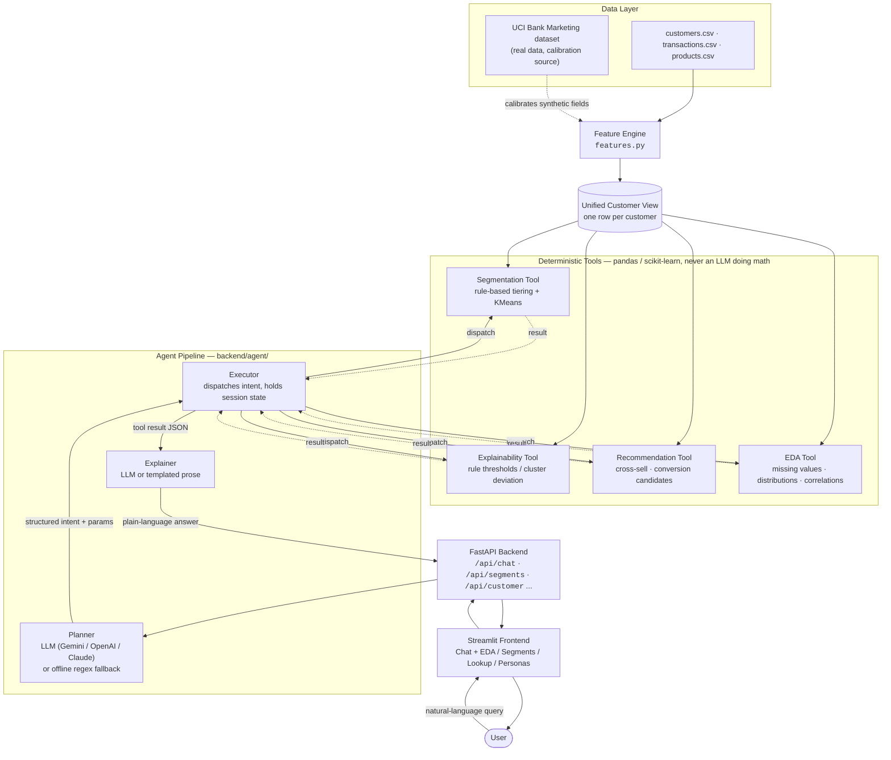

# SegmaAI — Customer Segmentation & Personalization Agent

An agent-driven system for retail banking that parses a natural-language
query, runs the right deterministic analytics pipeline (pandas/scikit-learn —
never an LLM doing math), and explains the result in plain language. Built
for the "Customer Segmentation & Personalization Agent for Retail Banking"
hackathon problem statement. [Demo Video](https://drive.google.com/file/d/1_AA36nqlI1WR7By1dMQ-YDvYgJvSZMwU/view?usp=sharing)

## Documentation & Demo

- 📄 **[Full project documentation](SegmaAI_Documentation.pdf)** — a written
  deep-dive covering the problem, all six core capabilities, system
  architecture, data provenance, reliability engineering, and tech stack.
- 🎥 **[Demo video](https://drive.google.com/file/d/1_AA36nqlI1WR7By1dMQ-YDvYgJvSZMwU/view?usp=sharing)**
  — a short walkthrough of SegmaAI in action.



### What SegmaAI actually does

**Segmentation — two ways to slice the customer base.** Rule-based tiering
sorts customers into Priority/Regular/Dormant using an explicit, auditable
threshold on balance *and* transaction frequency (a real AND, not an OR —
a customer needs both a high engagement score *and* a healthy balance to
be Priority, not either one alone). Unsupervised ML clustering (KMeans,
auto-k picked via silhouette score) runs the same job across income,
balance, spend, and credit behavior when you'd rather let the data reveal
its own groups than pre-specify the rule. **Why both exist:** a compliance-
facing decision needs a threshold a banker can point to and defend; a
discovery question needs the data to speak for itself — one segmentation
method can't serve both. (`backend/tools/segmentation_tool.py`)

**Explainability — every segment decision comes with a reason.** Ask "why
is this customer/tier here" and get the actual rule thresholds that placed
them (rule mode), or which features most distinguish their cluster from the
others (ML mode) — never a black-box label with no justification. **Why it
matters:** a segmentation a banker can't explain to a customer or a
regulator is a liability, not an insight. (`backend/tools/explainability_tool.py`)

**Recommendations & conversion candidates.** Per-tier cross-sell/retention
actions (what to offer a Dormant customer to re-engage them, what a Priority
customer is already primed for), plus a dedicated scoring pass that
identifies which Regular customers sit closest to Priority-tier thresholds
— i.e. who converts with the least push. **Why it matters:** a tier label on
its own is descriptive; the business value is in knowing what to *do* about
each one. (`backend/tools/recommendation_tool.py`)

**EDA dashboard.** Missing-value checks, distribution histograms,
correlation analysis, and dataset-wide overview stats (city/occupation mix,
product ownership rates) — answerable in natural language or from a
dedicated dashboard page. **Why it matters:** trusting a segmentation
requires first understanding the data underneath it — its gaps, its shape,
its outliers. (`backend/tools/eda_tool.py`)

**Customer lookup.** Pull any customer's full profile, and — if they've been
segmented — a plain-language explanation of why they landed in their tier.
**Why it matters:** segment-level answers serve strategy; a relationship
manager's day-to-day questions are about one customer at a time.

**Trend & time-based queries.** "Find customers whose balance has steadily
increased" surfaces behavioral trends (balance trend slope, 6-month spend
change) that a static tier label can't show. **Why it matters:** a snapshot
segment doesn't tell you who's trending up or down — often the more
actionable signal of the two.

### 1. The agent used to refuse its own job

**What it was:** four different tools — "explain segment basis", "average
metric by tier", "conversion candidates", "recommendations" — would check
`session.has_segmentation()` and, if no segmentation had run yet in this
session, return *"Run segmentation first"* instead of an answer.

**Why it was a problem:** the spec asks for an agent a user can "just ask and
get an answer" from. A first-time question like *"what should be done to
increase engagement for dormant customers?"* is a completely reasonable
opening move — there's no reason the user should have to know, or care, that
segmentation is a separate internal step. Every refusal was a broken demo
path and a worse user experience than the agent doing the obvious thing.

**How it's fixed:** each of those four tools (`_explain_basis`,
`_aggregate_metric`, `_conversion_candidates`, `_recommendation` in
[`backend/agent/executor.py`](backend/agent/executor.py)) now transparently
auto-runs rule-based tiering the moment it's needed, then continues —
the user never sees the internal step, they just get their answer.

### 2. "Which customers are priority?" fell through the cracks

**What it was:** the offline planner matched *"segment customers..."* and
*"on what basis were priority customers selected..."*, but a simpler,
extremely natural question — *"which customers are marked priority"*, *"show
me the dormant customers"* — matched no trigger at all and fell through to a
generic "I couldn't understand that" clarification.

**Why it was a problem:** this is arguably the single most obvious question
a retail-banking user would ask, and the agent had no path to answer it
without a segmentation already having been run and the user phrasing things
just right.

**How it's fixed:** a new `list_customers_by_tier` intent
([`backend/agent/planner.py`](backend/agent/planner.py)) recognizes a wide
range of phrasings — "which customers are marked priority", "show/list the
dormant customers", "who are the regular customers", tolerant of an optional
article ("the") or "me" in between — and its executor branch
(`_list_customers_by_tier`) auto-runs segmentation the same way the fixes
above do, so it works from a cold session with zero prior setup.

### 3. There was no way to know if any of this actually worked

**What it was:** no automated tests existed. "Does it work" meant manually
typing queries into the chat UI and eyeballing the response.

**Why it was a problem:** an agent with this many interacting parts
(planner → executor → tool → explainer, times two planner modes and two
segmentation methods) breaks in non-obvious ways when anything changes.
Manual spot-checks don't scale and don't survive a refactor.

**How it's fixed:** a real pytest suite now covers the system at three
levels ([`backend/tests/`](backend/tests/)):
- `test_segmentation_tool.py` — unit tests on the tiering/clustering math
  itself: every customer gets exactly one tier, "Priority" requires the
  *AND* of high score and high balance (not an OR bug), the ML path labels
  every row, nothing crashes on a zero-transaction customer.
- `test_executor_autonomy.py` — end-to-end tests through the real FastAPI
  app (`TestClient` against `/api/chat`) proving the four previously-gated
  flows and the new tier-listing intent all answer immediately on a fresh
  session, no refusals.
- `test_planner_intents.py` — a ~20-query parametrized battery asserting the
  offline planner lands the right intent, plus a matching subset that
  exercises the real LLM classification path when an API key is configured.

On top of the test suite, [`scripts/verify_autonomy.py`](scripts/verify_autonomy.py)
is a living-documentation script: it drives ~15-20 realistic queries against
a *live* running server, each on a fresh session, and produces a
human-readable report ([`scripts/autonomy_report.md`](scripts/autonomy_report.md))
of query → intent → answer. It's re-runnable any time as a sanity check that
the whole stack, not just unit-level pieces, still behaves.

## Why it's built this way

- **The dataset is hybrid, not a single Kaggle CSV -- and partly real.**
  `data/generate_data.py` generates 1,500 customers, ~628k transactions
  (24 months), and product ownership from 7 realistic persona archetypes.
  Age, marital status, education, housing/personal loan uptake, and prior
  marketing-campaign response are bootstrapped from 45,211 real rows of the
  **UCI Bank Marketing dataset** (job-matched per archetype); card
  utilization is calibrated to published Kaggle "Credit Card Customers"
  statistics. IBM TabFormer was evaluated but its real transaction file is
  currently undownloadable (IBM's own GitHub LFS quota is exceeded) -- our
  own transaction generator stands in for it. Full provenance --
  exactly which columns are real, calibrated, or synthetic -- is in
  [`data/DATA_SCHEMA.md`](data/DATA_SCHEMA.md).
- **The LLM never touches the numbers.** The planner turns a question into a
  structured intent (`segment_customers`, `aggregate_metric`, `explain_segment_basis`,
  `conversion_candidates`, `recommendation`, `list_customers_by_tier`, EDA intents, …);
  the executor runs that intent through plain pandas/scikit-learn; only the
  final human-readable phrasing optionally goes through an LLM. This keeps
  results deterministic, reproducible, and fast.
- **Works with zero API keys.** If no `GEMINI_API_KEY` / `OPENAI_API_KEY` /
  `ANTHROPIC_API_KEY` is set, the planner falls back to a deterministic
  keyword/regex parser and the explainer falls back to templated text — the
  whole app is fully functional offline. Set a key in `.env` to upgrade the
  planner/explainer to a real LLM (see `.env.example`).
- **Human-in-the-loop.** Ambiguous queries (e.g. "segment customers" with no
  criteria) return a clarifying question instead of guessing.

## Setup

```bash
python -m venv venv
venv\Scripts\pip install -r requirements.txt      # Windows
# source venv/bin/activate && pip install -r requirements.txt   # macOS/Linux

python data\generate_data.py                       # generates data/*.csv (~1-2 min)
```

Optional: copy `.env.example` to `.env` and set one LLM API key to enable the
LLM planner/explainer. Not required for the app to work.

## Run

Two terminals (or use `run_backend.bat` / `run_frontend.bat` on Windows):

```bash
# Terminal 1 -- API
venv\Scripts\python -m uvicorn backend.main:app --reload --port 8000

# Terminal 2 -- UI
venv\Scripts\python -m streamlit run frontend/app.py
```

Open the Streamlit URL it prints (default `http://localhost:8501`). The
status strip under the navigation shows whether the LLM planner is active
or running offline.

You can also talk to the agent directly via the API, no UI required:

```bash
curl -X POST http://localhost:8000/api/chat -H "Content-Type: application/json" \
  -d '{"session_id":"demo","query":"Segment customers into priority, regular and dormant customers based on balance being maintained and frequency of transactions"}'
```

## Project layout

```
data/
  generate_data.py        data generator (seeded, reproducible; real + calibrated + synthetic)
  uci_calibration.py       bootstraps real fields from the UCI Bank Marketing dataset
  uci_raw/bank-full.csv    real UCI source data (45,211 rows, committed for verifiability)
  DATA_SCHEMA.md           schema + full data provenance (real / calibrated / synthetic per column)
  customers.csv / transactions.csv / products.csv   (agent-facing)
  customers_ground_truth.csv   dev-only, includes hidden persona label

backend/
  features.py              Feature Engine -> Unified Customer View
  tools/
    eda_tool.py             missing values, distributions, correlations, groupby
    feature_tool.py          feature selection for clustering (variance/correlation pruning)
    segmentation_tool.py      rule-based tiering + KMeans clustering (auto-k via silhouette)
    explainability_tool.py    rule thresholds / cluster centroid deviation explanations
    recommendation_tool.py    cross-sell/retention rules + conversion-candidate scoring
  agent/
    llm_client.py            pluggable Gemini/OpenAI/Anthropic client (optional)
    planner.py                NL query -> structured intent (LLM or offline regex/keyword)
    executor.py                runs the intent through the tools above, holds session state
    explainer.py                tool JSON -> human-readable answer (LLM or templated)
  main.py                    FastAPI app (the "API" interaction surface)
  tests/                      pytest suite: segmentation math, executor autonomy, planner intents

frontend/
  app.py                     Streamlit chat + EDA/Segments/Customer/Persona dashboards
  api_client.py                thin HTTP client for the backend
  theme.py                     "ledger paper" light theme -- validated color palette,
                                centered nav, CSS-only motion

scripts/
  verify_autonomy.py         drives ~15-20 realistic queries against a live server,
                              produces a human-readable autonomy report
  autonomy_report.md          latest run's output (living documentation)
```

## Example queries to try

- "Segment customers into priority, regular and dormant customers based on balance being maintained and frequency of transactions"
- "On what basis were priority customers selected?"
- "What is the average size of transactions for priority and regular customers?"
- "Which regular customers can be converted to priority? What should be done for them?"
- "Segment customers using ML clustering across income, balance, spend and credit behaviour"
- "Which customers are marked priority?" / "Show me the dormant customers"
- "Why does customer CUST00001 belong to their segment?"
- "Are there any missing values in the data?"
- "Find customers whose balance has steadily increased"
- "Recommend products for Dormant customers"
